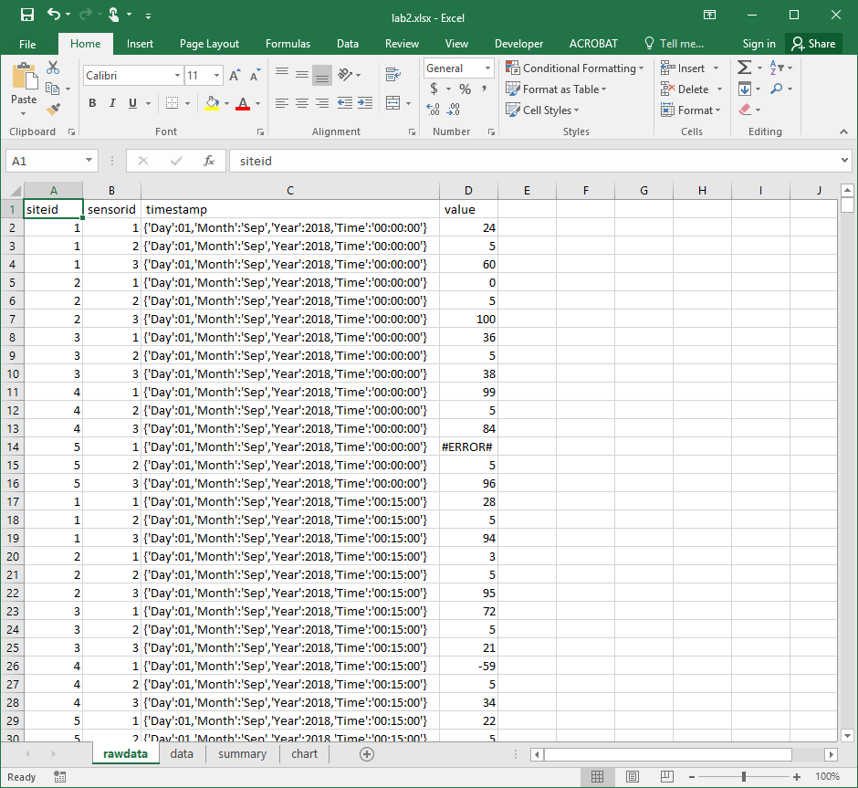
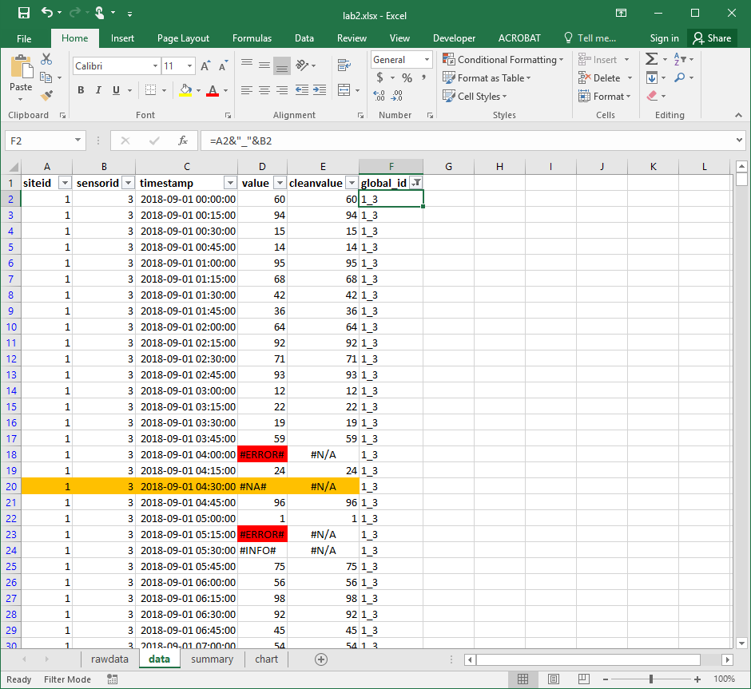
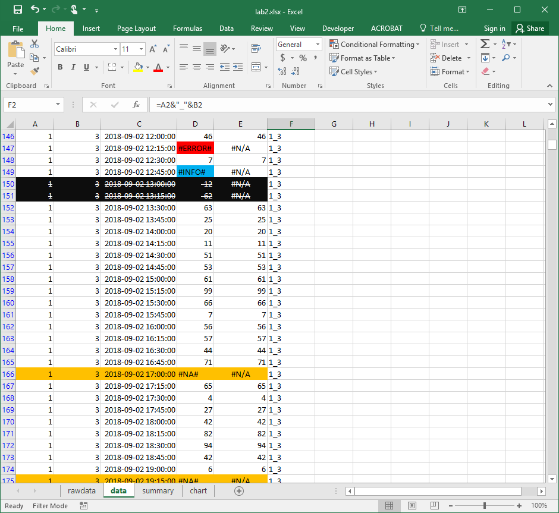
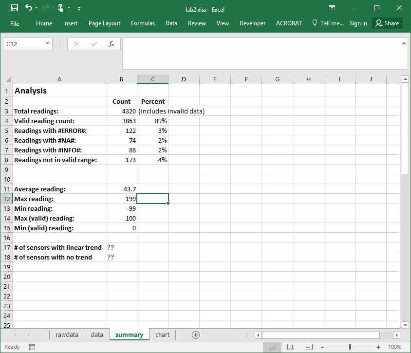

## DATA 530 Lab 2 - Excel Formulas and Functions

In this lab you will practice using Microsoft Excel to manipulate, transform, and analyze data.

### Objectives

  - Load CSV data into Excel and convert into a spreadsheet for processing.
  - Perform simple data cleaning (missing, incorrect) values, data type conversion, and cell formatting.
  - Understand and use Excel cell addressing including absolute addresses.
  - Create formulas including string and date functions, aggregate functions, and formulas with decisions.
  - Perform sorting and filtering to transform data for analysis.
  - Produce charts to visualize data and communicate results including using trendlines. 

### Analysis Problem and Goals

This scenario involves analyzing data collected by sensors and applies to a variety of real-world applications including environmental monitoring (temperature, precipitation, wind, etc.), industrial and production sensors, and even monitoring of people using mobile devices and GPS. There are multiple monitoring *sites*.  Each site has one or more *sensors* that take a reading in a given interval.  Typically, *readings* are either an integer or floating-point value.  In this lab, each reading will consist of:

  - **siteid** - an integer identifying a site uniquely
  - **sensorid** - an integer identifying a sensor at a particular site uniquely
  - **timestamp** - when the reading occurred (in JSON format)
  - **value** - an integer reading between 0 and 100, although data may be missing or incorrect

Sensor readings are done every 15 minutes but may be missed (no data) or contain incorrect values out of range (less than 0 and above 100) or values that indicate error conditions (not at a number at all).

[Download data set](data.csv) that consists of 5 sites each with 3 sensors that take readings every 15 minutes for 3 days.

#### Goals

The analysis goals are:

 1. **Loading** - load the input CSV file into Excel and convert into an Excel spreadsheet file.
 2. **Cleaning** - take the raw data and remove missing/incomplete values and convert the time currently in JSON string form to an Excel datetime.
 3. **Formatting** - apply conditional formating to clean data set to improve readability.
 4. **Summary** - calculate summary statistics for the data set including number of readings and maximum/minimum values.
 5. **Visualization** - create charts that show the sensor readings by time with trendlines.
 6. **Analysis** - determine if there are any trends in the sensor data.

### Marking and Evaluation (18 marks)

Marks are awarded by *precisely* following these requirements:

1. **Loading (1 mark) -** submit an Excel file called **lab2.xlsx** where the first sheet is called **rawdata** and contains the loaded data set with no changes.

2. **Cleaning and Formatting (8 marks) -** create a second sheet called **data** that contains the data set after all incorrect and out-of-range values have been removed. Data should be referenced from **rawdata** sheet NOT copied.

	* Header fields must be in bold font (0.5 marks).

	* Create a new column called **cleanvalue** where any data that is not a number, is less than 0, or above 100 should be replaced by **NA()**. Otherwise copy over the number in the **value** column. (1 mark)	
	
	* Timestamp field must be formatted as a date field in this format yyyy/mm/dd hh:mm:ss (2 marks) (will need custom format). Hint: May need to use [DATEVALUE function](https://support.office.com/en-us/article/DATEVALUE-function-df8b07d4-7761-4a93-bc33-b7471bbff252), [TIME function](https://support.office.com/en-us/article/TIME-function-9A5AFF99-8F7D-4611-845E-747D0B8D5457), and [MID](https://support.office.com/en-us/article/MID-MIDB-functions-d5f9e25c-d7d6-472e-b568-4ecb12433028) to convert date. ([More info](http://chandoo.org/wp/2010/03/23/text-to-date-convertion/)) Note that both the DATE and TIME need to be converted and added together to get a DATETIME.

	* Using conditional formatting rules, format any value with an **#ERROR#** value to have a red background and any value with an **#INFO#** to have a blue background. (1 mark)

	* Using conditional formatting rules, format the whole row that contains a **#NA#** value to have an orange background, and any value not in range 0 to 100 have a black background with white font with strikethrough. Hint: Use conditional rule: "Use a formula to determine which cells to format." (1 mark)

	* Add a column called **global_id** that is generated by ```siteid&"_"&sensorid``` (0.5 marks).

	* Data must be sorted by siteid (ascending), sensorid (descending), then timestamp (ascending) (1 mark).

	* Filter data to not display any rows for site 3 sensor 1. Note: Do not delete any data. (1 mark).

3. **Summary (5 marks) -** create a third sheet called **summary** that contains the following items:

	* Count of total readings and valid readings (with percentage of total). (0.5 marks)
	* Count of readings wwith #ERROR#, #NA#, and #INFO#, and not in range (with percentages). (2 marks)
	* Average reading (0.5 marks)
	* Maximum reading (0.5 marks)
	* Minimum reading (0.5 marks)
	* Maximum valid reading (0.5 marks) Hint: Ctrl+Shift+Enter will be useful. [Reference](http://superuser.com/questions/674566/when-to-use-ctrlshiftenter-and-when-to-use-enter-in-excel)
	* Minimum valid reading (0.5 marks)
	
4. **Visualization (3 marks) -** create a **XY Scatter chart (with smooth lines and markers)** on a sheet called **chart** that shows the readings by time for all three sensors at site 2. Add a linear trendline for sensor 3 at site 2. Hint: Adjusting axis will be necessary, and I suggest making separate plots on the same sheet rather than plotting everything on one sheet.

5. **Analysis (1 marks) -** in the **summary** sheet put the following:
	* Number of sensors with a linear trend (observed not calculated) (0.5 marks)
	* Number of sensors with no trend (observed not calculated) (0.5 marks)

When complete, add your Excel file into this repo **lab2.xlxs** and submit it on GitHub as normal.

### Screenshots

#### rawdata sheet



#### data sheet




#### summary sheet


